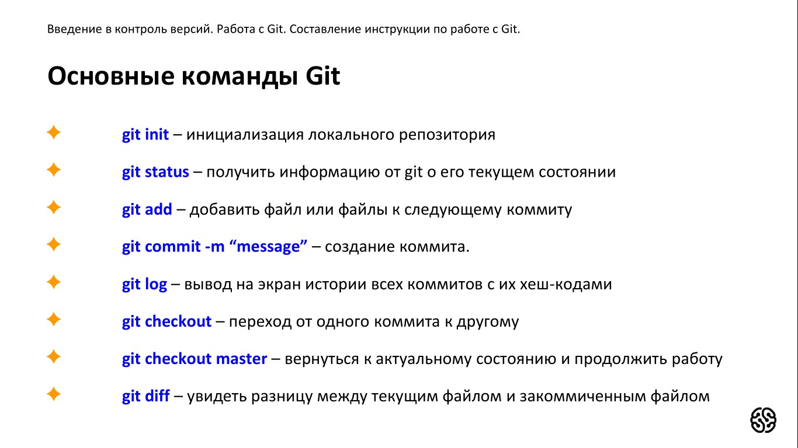
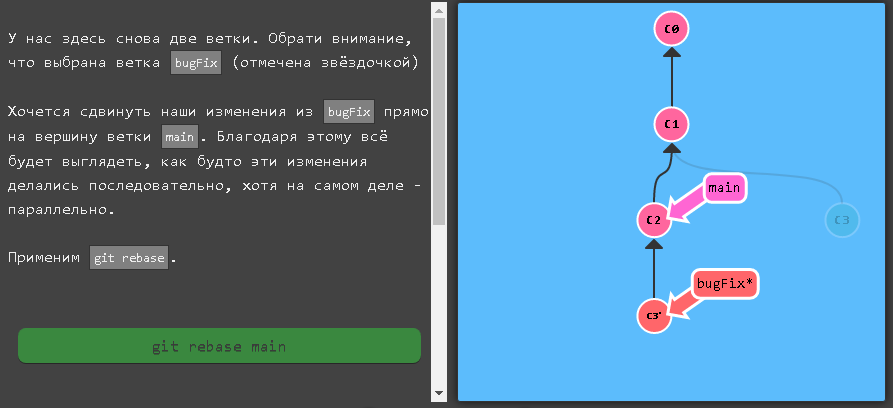
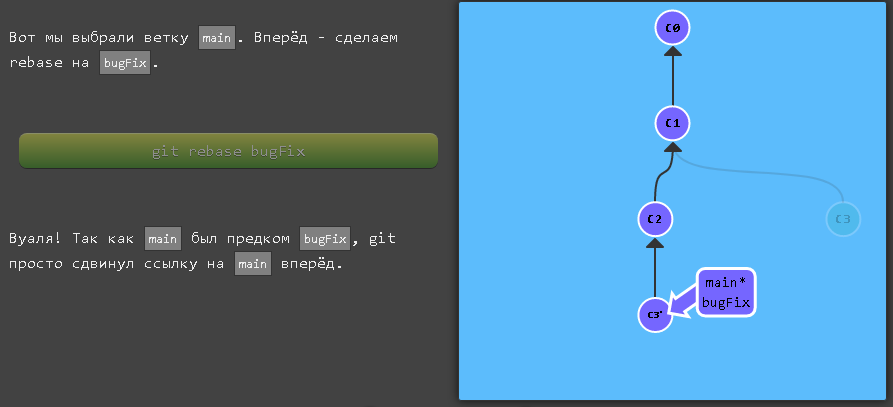
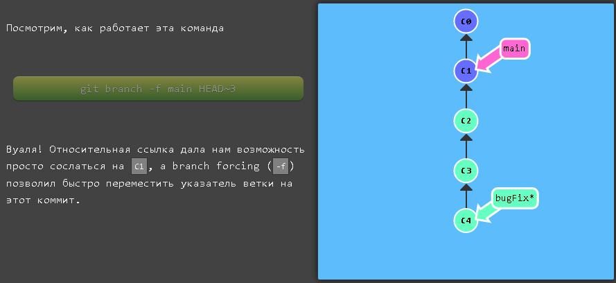

# Инструкция для работы с Git и удалёнными репозиториями

## Что такое Git?
Git - это одна из реализаций распределённых систем контроля версий, имеющая как и локальные, так и удалённые репозитории. Является самой популярной реализацией систем контроля версий в мире.
## Подготовка репозитория
Для создание репозитория необходимо выполнить команду *git init*  в папке с репозиторием и у Вас создаться репозиторий (появится скрытая папка .git)

### Git add
Для добавления измений в коммит используется команда *git add*. Чтобы использовать команду *git add* напишите *git add <имя файла>*

### Просмотр состояния репозитория
Для того, чтобы посмотреть состояние репозитория используется команда *git status*. Для этого необходимо в папке с репозиторием написать *git status*, и Вы увидите были ли измения в файлах, или их не было.

## Создание коммитов
Для того, чтобы создать коммит(сохранение) необходимо выполнить команду *git commit*. Выполняется она так: *git commit -m "<сообщение к коммиту>*. Все файлы для коммита должны быть ***ДОБАВЛЕНЫ*** и сообщение к коммиту писать ***ОБЯЗАТЕЛЬНО***.

## Перемещение между сохранениями
Для того, чтобы перемещаться между коммитами, используется команда *git checkout*. Используется она в папке с репозиторием следующим образом: *git checkout <номер коммита>*

## Перемещение между ветками
Для того, чтобы перемещаться между ветками, используется команда *git checkout*. Используется она в папке с репозиторием следующим образом: *git checkout <имя ветки (master  или др.)>*

## Журнал изменений
Для того, чтобы посмтреть все сделанные изменения в репозитории, используется команда *git log*. Для этого достаточно выполнить команду *git log* в папке с репозиторием

### Создание ветки

Для того, чтобы создать ветку, используется команда *git branch*. Делается это следующим образом в папке с репозиторием: *git branch <название новой ветки>*

## Слияние веток

Для того чтобы дабавить ветку в текущую ветку используется команда *git merge (name branch)*

## Удаление веток
Для удаления ветки ввести команду "git branch -d 'name branch'"

## Присвоение Master
git config --global init.defaultBranch master, хотя git checkout master пишется проще.

## Создание сокращенного журнала*
git log --oneline

## Создаем ссылки

  [Ссылка на git](https://git-scm.com/book/ru/v2/%D0%9E%D1%81%D0%BD%D0%BE%D0%B2%D1%8B-Git-%D0%A1%D0%BE%D0%B7%D0%B4%D0%B0%D0%BD%D0%B8%D0%B5-Git-%D1%80%D0%B5%D0%BF%D0%BE%D0%B7%D0%B8%D1%82%D0%BE%D1%80%D0%B8%D1%8F)

## Сылка на другой файл в этой папке

 [ссылка на другой файл этой папки](./script.js)

 ## Вставляем картинку

 Изображение необходимо скопировать в папку репозитория. 
 _Есть тонкости_: картинку в коммиты не добавляют, при сохранении будет вылезать ошибка о не добавлености картинки в коммит. Что бы этого избежать создаем файл .gitignore прописываем туда нашу картинку. Сохраняем.
 

## Выделение текста

Что юы выделить текст его необходимо обрамить звездочками (*). К примеру *вот так* Или знаком нижнего подчеркивания вот так (_) _вот так_

Что бы выделить текст полужирным его необходимо обрамить (**). К примеру **вот так** Или знаком двойного нижнего подчеркивания (__) __вот так__
Альтернативные способ выделения текста нужны для того что бы могли совмещать эти 2 способа. Например _этот текст может быть курсивные и **полужирным**._

## Списки
Что бы выделить ненумерованные списки выделить (*).
Что бы добавить ненумерованные списки нужно пункты выделить (*) или поставить знак (+) вот так
* Элемент1
* Элемент2
* Элемент3
+ Элемент4

Что бы добавить нумерованные списки их нужно нумеровать. 
1. Первый пункт
2. Втрой пункт

## Работа с интерактивным  rebase

В этой команде можно редактировать наименование коммитов и т.п.
Для начала git log --online (чтоб проще смотреть), смотрим коммиты и выбираем нужный
Вводим функцию git rebase -i (номер коммита), откроется редактор. Там выбираем нужный коммит и меняем pick на нужную нам фкнцию (на семинаре мы использовали reword). Сохраняемся и закрываем редактор. Должен открытся другой редактор, в первой строчке имя нашего коммита, его переименовываем, сохраняем и закрываем. Имя коммита должен перезаписатся.

## Работа с rebase

Если у нас есть 2 веки main и bugFix нам нужно их объеденить. Мы вызываем команду git rebase main и коммит с bugFix скопируется в ветку main со свим коммитом на самый вверх как бы продолжение ветки будет.

Теперь изменения из bugFix находятся в конце ветки main и являют собой линейную последовательность коммитов.

Обрати внимание, что коммит С3 до сих пор существует где-то, а С3' - это его "копия" в ветке main

Единственная проблема - ветка main не обновлена до последних изменений. Исправляем. 
Выбрали ветку main. Сделаем rebase bugFix. Так как main был предком bugFix, git просто сдвинул ссылку на main вперёд.

## HEAD

Поговорим о "HEAD". HEAD - это символическое имя текущего выбранного коммита — это, по сути, тот коммит, над которым мы в данным момент работаем.

HEAD всегда указывает на последний коммит из вашего локального дерева. Большинство команд Git, изменяющих рабочее дерево, начнут с изменения HEAD.

Обычно HEAD указывает на имя ветки (например, bugFix). Когда вы делаете коммит, статус ветки bugFix меняется и это изменение видно через HEAD.

## Относительные ссылки

Передвигаться по дереву Git при помощи указания хешей коммитов немного неудобно. В реальной ситуации у вас вряд ли будет красивая визуализация дерева в терминале, так что придётся каждый раз использовать git log, чтобы найти хеш нужного коммита

Более того, хеши в реальном репозитории Git намного более длинные. Например, хеш для коммита, который приведён в предыдущем уровне - fed2da64c0efc5293610bdd892f82a58e8cbc5d8. Не очень просто для произношения =)

Хорошая новость в том, что Git достаточно умён в работе с хешами. Ему нужны лишь первые несколько символов для того, чтобы идентифицировать конкретный коммит. Так что можно написать просто fed2 вместо колбасы выше.

Как мы уже говорили, указание на коммит при помощи его хеша - не самый удобный способ, поэтому Git поддерживает относительные ссылки и они прекрасны!

С относительными ссылками можно начать с какого-либо удобного места (например, с ветки bugFix или от HEAD) и двигаться от него

Относительные ссылки - мощный инструмент, но мы покажем два простых способа использования:

Перемещение на один коммит назад ^
Перемещение на несколько коммитов назад ~<num>

Так что main^ означает "первый родитель ветки main".

main^^ означает прародитель (родитель родителя) main

## Оператор "~"

Предположим, нужно переместиться на много шагов назад по дереву. Было бы неудобно печатать ^ несколько раз (или несколько десятков раз), так что Git поддерживает также оператор тильда (~).

К тильде (опционально) можно добавить количество родительских коммитов, через которые нужно пройти. Посмотрим, как это работает git checkout HEAD~4 на 4 коммита.

## Перемещение ветки (branch forcing)

Теперь мы разбираемся в относительных ссылках, так что можно реально использовать их для дела.

Одна из наиболее распространённых целей, для которых используются относительные ссылки - это перемещение веток. Можно напрямую прикрепить ветку к коммиту при помощи опции -f. Например, команда:

git branch -f main HEAD~3

Переместит (принудительно) ветку main на три родителя назад от HEAD.

## Работа с GitHub

1. Создали аккаунт на GitHub
2. Создать локальный репозиторий
3. "Подружить ваш локольный репозиторий и удаленный". GitHub сам подскажет как это сделать.

git remote add origin ссылка на репозиторий
git branch -M main
git push -u origin main

4. Отправить push ваш локальный репозиторий в удаленный на GitHub, при этом он создает ветку main.
5. Переходим в папку командой (cd имя папки)
6. Провести изменения с другого компьютера
7. выкачать pull актуальное состояние из удаленного репозитория. 

### Работа с открытым кодом через GitHab
1. Делаем fork интересующего нас проекта
2. Делаем git clone для нашей версии этого репозитория
3. Создаем ветку с предполагаемыми изменениями
4. производим все изменения только в этой ветке
5. Отправлям эти изменения на свой аккаунт push
6. В окне на GitHub появляется возможность отправить pull request 

